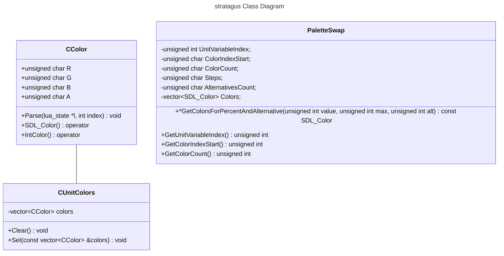

```mermaid
---
title: stratagus Class Diagram
---
classDiagram
	class CColor{
		+unsigned char R
		+unsigned char G
		+unsigned char B
		+unsigned char A
		+Parse(lua_state *l, int index) void
		+SDL_Color() operator
		+IntColor() operator
	}

	class CUnitColors{
		-vector~CColor~ colors
		+Clear() void
		+Set(const vector~CColor~ &colors) void
	}

	class PaletteSwap{
		-unsigned int UnitVariableIndex;
		-unsigned char ColorIndexStart;
		-unsigned char ColorCount;
		-unsigned char Steps;
		-unsigned char AlternativesCount;
		-vector~SDL_Color~ Colors;
		+*GetColorsForPercentAndAlternative(unsigned int value, unsigned int max, unsigned int alt) const SDL_Color
		+GetUnitVariableIndex() unsigned int
		+GetColorIndexStart() unsigned int
		+GetColorCount() unsigned int
	}

	CColor -- CUnitColors
```
