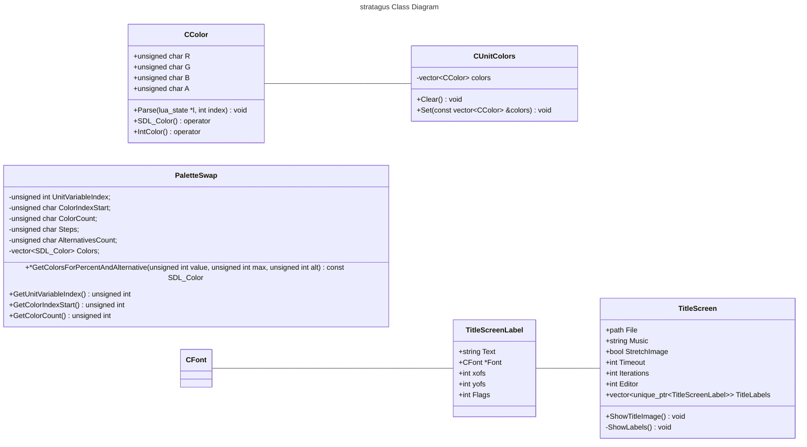

```mermaid
---
title: stratagus Class Diagram
---
classDiagram
	direction LR
	%% Classes defined in color.h
	class CColor{
		+unsigned char R
		+unsigned char G
		+unsigned char B
		+unsigned char A
		+Parse(lua_state *l, int index) void
		+SDL_Color() operator
		+IntColor() operator
	}

	class CUnitColors{
		-vector~CColor~ colors
		+Clear() void
		+Set(const vector~CColor~ &colors) void
	}

	class PaletteSwap{
		-unsigned int UnitVariableIndex;
		-unsigned char ColorIndexStart;
		-unsigned char ColorCount;
		-unsigned char Steps;
		-unsigned char AlternativesCount;
		-vector~SDL_Color~ Colors;
		+*GetColorsForPercentAndAlternative(unsigned int value, unsigned int max, unsigned int alt) const SDL_Color
		+GetUnitVariableIndex() unsigned int
		+GetColorIndexStart() unsigned int
		+GetColorCount() unsigned int
	}

	%% Classes defined in title.h
	class CFont
	
	class TitleScreenLabel{
		+string Text
		+CFont *Font
		+int xofs
		+int yofs
		+int Flags
	}

	class TitleScreen{
		+path File
		+string Music
		+bool StretchImage
		+int Timeout
		+int Iterations
		+int Editor
		+vector~unique_ptr~TitleScreenLabel~~ TitleLabels
		+ShowTitleImage() void
		-ShowLabels() void
	}

	%% Connections
	CColor -- CUnitColors
	CFont -- TitleScreenLabel
	TitleScreenLabel -- TitleScreen

	%% Links
	link CColor "https://github.com/SimoneStarace/stratagus/blob/uml_diagrams/src/include/color.h"
	link CFont "https://github.com/SimoneStarace/stratagus/blob/uml_diagrams/src/include/title.h"
```
